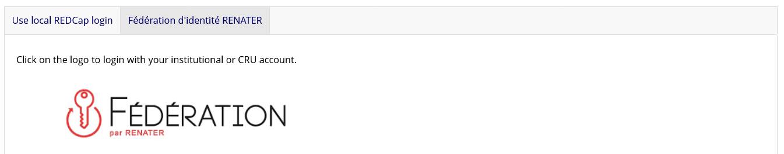
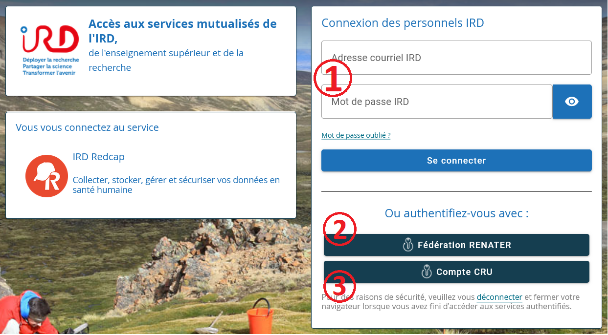
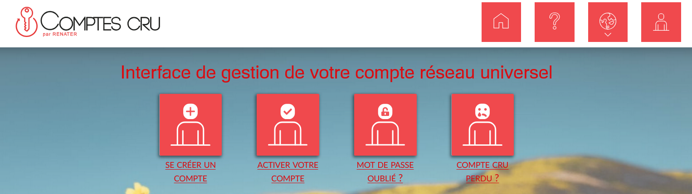

# Créer un utilisateur dans IRD REDCap

> Personnel IRD, Personnel non IRD, Personnel des sites partenaires.

::: callout-note
## Fiche en cours de rédaction

Cette fiche est en construction. [Contribuez sur GitLab !](https://gitlab.institutionnel.org/redcap-guide-fr/-/issues/new)
:::

## Introduction

*L'instance IRD REDCap utilise l'authentification de la fédération RENATER pour la gestion des utilisateurs.*

Pour la création d'un nouvel utilisateur, il faut se rendre sur www.ird.fr afin de remplir le formulaire de la charte utilisateur. Une fois le compte valider, l'utilisateur reçoit les instructions pour la connexion à IRD REDCap.

## Procédure

1\) Remplir la charte unitilasteur en cliquant sur [Demande d'ouverture d'un compte REDCap IRD](https://redcap.ird.fr/surveys/?s=YLRN8H7MYR8TPRRY)

2\) Une fois le compte validé:

a\) Pour les utilisateurs avec une adresse mail de la fédération RENATER (personnel IRD, etc.):

- Cliquer sur Le logo de la Fédération par Renater

- Renseigner son adresse mail et mot de passe professionnel pour le personnel IRD (1) et les autres utilisateurs de la fédération RENARER (2). Les utilisateurs hors Fédération RENATER doivent cliquer sur le bouton Compte CRU (3) :

Les utilisateurs hors Fédération RENATER doivent créer un compte CRU afin d'avoir accès à IRD REDCap. Pour ce faire:

1\) Aller sur la page <https://cru.renater.fr/sac/> et suivre les 3 étapes:

Se créer un compte –\> Activer votre compte –\> Mot de passe oublié?

A chaque étape, vous recevez un mail pour la suite. Une fois le mot de passe crée, l'utilisateur peut se connecter à IRD à partir su bouton (3).

## Première connexion à IRD REDCap

Lors de la première connexion à IRS REDCap, l'utilisateur doit créer son profil et valider son adresse mail:

## Références

- [Documentation REDCap Community](https://community.projectredcap.org/)
